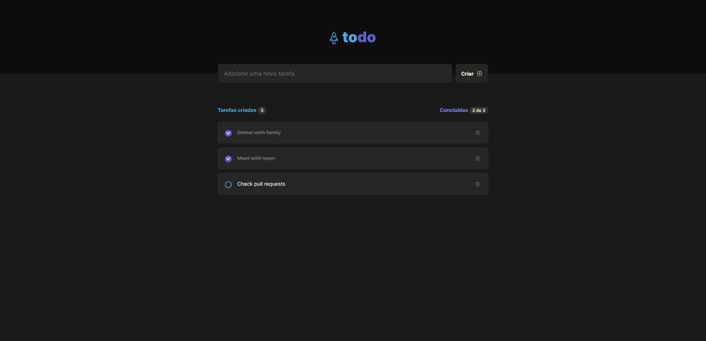

<h1 align="center">ToDo List</h1>

Criado como desafio para fixar os conceitos básicos do React e TypeScript  

  <a href="#-tecnologias">Tecnologias</a>&nbsp;&nbsp;&nbsp;|&nbsp;&nbsp;&nbsp;
  <a href="#-projeto">Projeto</a>&nbsp;&nbsp;&nbsp;|&nbsp;&nbsp;&nbsp;
  <a href="#memo-licença">Licença</a>

  

 

  

## 🚀 Tecnologias

Esse projeto foi desenvolvido com as seguintes tecnologias:

- ReactJS
- TypeScript
- JavaScript
- HTML
- Module CSS
- Git e Github
- Figma

## 💻 Projeto

A ToDo List é uma página para organizar suas tarefas e objetivos diários.

- [Acesse o projeto finalizado, online](https://to-do-list-react-ts-ten.vercel.app/)

## :memo: Licença

Esse projeto está sob a licença MIT.

---
